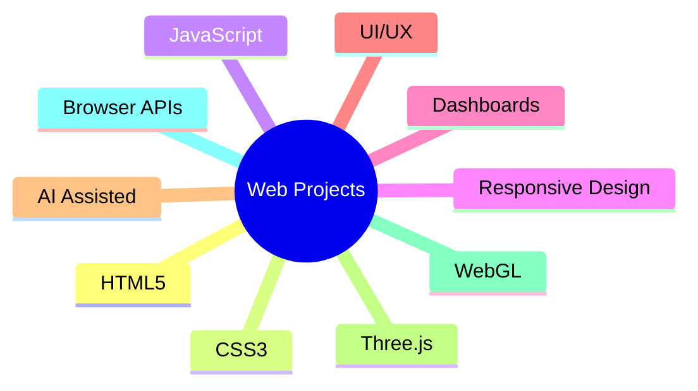

<div align="center">

# 🌐 WEB PRACTICE PROJECTS

### 🚀 Modern Web Development • UI/UX Experiments • Interactive Applications


<br>


---

## 💻 About This Repository

A curated collection of modern web development projects, UI/UX experiments, dashboard systems, interactive applications, creative interfaces, and browser-based experiences.

This repository serves as my personal playground for:

🎨 UI/UX Design

⚡ Frontend Development

📊 Dashboard Systems

🤖 AI-Assisted Development

📱 Responsive Web Design

🧠 Problem Solving

🚀 Performance Optimization

🌐 Real-World Web Applications

---

# 📈 Repository Snapshot

<div align="center">

| Category             | Focus                   |
| -------------------- | ----------------------- |
| 🎨 UI Design         | Modern Interfaces       |
| 📊 Dashboards        | Data Visualization      |
| 🤖 AI Projects       | AI-Assisted Development |
| 🌐 Web Apps          | Interactive Experiences |
| 📱 Responsive Design | Mobile Friendly         |
| ⚡ Optimization       | Performance Focus       |

</div>

---

# 🖼 Featured Projects

## 🎓 SGSITS Placement Information Portal

A modern placement intelligence platform designed for SGSITS students.

### Features

* Advanced Search
* Placement Analytics
* Company Database
* Branch Filters
* Package Tracking
* Responsive Dashboard


---


---

## 🎓 SGSITS Placement Portal V2

Enhanced placement dashboard with advanced filtering, analytics, and modern UI.


---

## ✨ Gesture Paint Ultra

Interactive browser-based gesture drawing experience.


---

## 🤖 Gesture AR Studio

Hand-tracking and voice-controlled browser interaction experiments.

### Includes

* Gesture Recognition
* Voice Commands
* Three.js Rendering
* WebGL Graphics
* Interactive Objects
* AI-Assisted Development

---

# 🏗 Repository Structure

```text
web-practice-project
│
├── 🎓 Placement Portals
│   ├── Placement Portal V1
│   └── Placement Portal V2
│
├── 🤖 AI Experiments
│   ├── Gesture AR Studio
│   └── Gesture Paint Ultra
│
├── 🎨 UI/UX Experiments
│
├── 📊 Dashboard Systems
│
├── ⚡ Optimization Projects
│
└── 🌐 Web Applications
```

---

# 🛠 Technology Ecosystem



---

# 📊 Development Focus

```text
UI/UX Design                ████████████████ 95%
Frontend Development        ████████████████ 95%
Problem Solving             ██████████████   90%
AI Assisted Development     ███████████████ 92%
Dashboard Development       ██████████████   88%
Performance Optimization    ████████████     80%
```

---

# 🚀 What You'll Find Here

### 🎨 Design

* Landing Pages
* Dashboards
* Modern Interfaces
* Responsive Layouts

### ⚡ Engineering

* Browser Applications
* Interactive Components
* JavaScript Utilities
* Frontend Systems

### 🤖 AI-Assisted Projects

* Rapid Prototyping
* Feature Exploration
* UI Generation
* Experimental Applications

### 📊 Data Visualization

* Analytics Dashboards
* Statistics Panels
* Interactive Charts
* Information Systems

---

# 📱 Design Philosophy

```text
Simple
│
├── Modern
│
├── Responsive
│
├── Fast
│
├── Interactive
│
└── User Focused
```

---

# 🎯 Repository Goals

✔ Learn by Building

✔ Explore Modern Web Technologies

✔ Improve UI/UX Skills

✔ Practice Real-World Development

✔ Experiment with AI-Assisted Workflows

✔ Build Useful Projects

✔ Continuously Improve Code Quality

---

# 📅 Future Roadmap

* [ ] More Dashboard Projects
* [ ] AI-Powered Web Applications
* [ ] Three.js Experiments
* [ ] Advanced Animations
* [ ] Data Visualization Systems
* [ ] Web Performance Research
* [ ] PWA Implementations
* [ ] Accessibility Improvements
* [ ] Full Stack Integrations
* [ ] Open Source Contributions

---

# ⚠ AI Usage Disclosure

Many projects in this repository are developed using AI-assisted workflows.

AI is used for:

* Rapid Prototyping
* Brainstorming
* UI Exploration
* Code Generation
* Debugging Assistance

All projects are customized, tested, modified, and optimized as part of the learning process.

---

# 🤝 Contributions

Suggestions, feedback, and ideas are always welcome.

Ways to contribute:

🐛 Report Bugs

💡 Suggest Features

⚡ Improve Performance

🎨 Improve UI/UX

📖 Improve Documentation

🚀 Share Ideas

---

# ⭐ Support

If you find these projects interesting:

⭐ Star the Repository

🍴 Fork the Repository

📢 Share with Others

💬 Give Feedback

---

<div align="center">

# 🚀 Built With Curiosity & Continuous Learning

### By Devesh Kumar Gawai

*"Learning web development one project at a time."*

</div>
