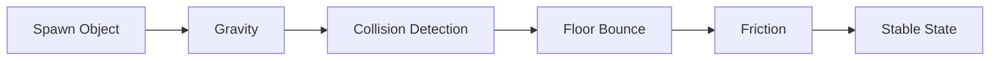
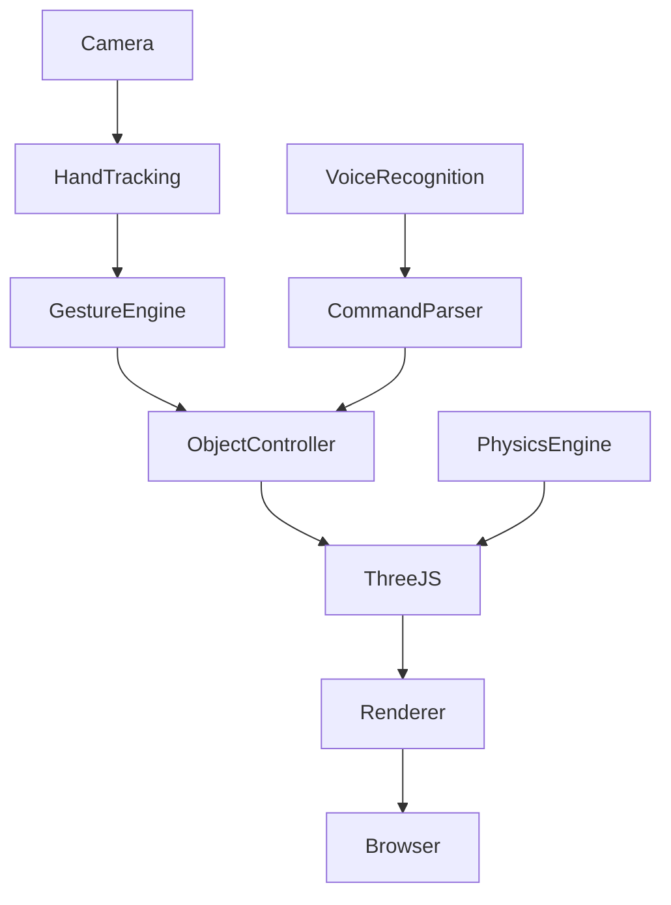

<div align="center">

# ✦ GESTURE AR STUDIO ✦

### Control 3D Objects with Your Hands & Voice — Directly in the Browser


---

### 🎥 Live Demo

👉 **Try it Here**

https://devesh-gawai.github.io/web-practice-project/gesture-ar-studio/GESTURE_AR_STUDIO.html

---

### ⚠️ Important

This project was built as a **personal learning & experimentation project**.

It is:

✅ AI-assisted (Claude Sonnet used extensively during development)

✅ Independent

✅ Non-commercial

✅ Not affiliated with any organization

✅ Built to explore browser-based AR-style interaction systems

---

</div>

---

# ✨ What is Gesture AR Studio?

Gesture AR Studio is an experimental browser-based interactive 3D environment where users can manipulate virtual objects using:

🖐️ Hand Gestures

🎙️ Voice Commands

🎨 Real-Time 3D Controls

⚛️ Physics Simulation

📊 Performance Analytics

All running directly in the browser.

No installation.

No external software.

Just open the page and start interacting.

---

# 🌟 Showcase

<div align="center">

| Gesture Control | Object Manipulation | Voice Commands |
|:---:|:---:|:---:|
|  |  |  |

</div>

---

# 🚀 Features

## 🖐️ Gesture Recognition

<table>
<tr>
<td>✋ Open Palm</td>
<td>Select Objects</td>
</tr>

<tr>
<td>🤏 Pinch</td>
<td>Grab & Move</td>
</tr>

<tr>
<td>🤞 Double Pinch</td>
<td>Duplicate Objects</td>
</tr>

<tr>
<td>✊ Fist</td>
<td>Delete Objects</td>
</tr>

<tr>
<td>☝️ Point</td>
<td>Teleport Objects</td>
</tr>

<tr>
<td>🖐️ Spread</td>
<td>Scale Objects</td>
</tr>

<tr>
<td>🤘 Rock</td>
<td>Rotate Objects</td>
</tr>

<tr>
<td>👍 Thumbs Up</td>
<td>Lock / Unlock</td>
</tr>

</table>

---

## 🎙️ Voice Commands

```text
Create Sphere
Create Cube
Delete
Duplicate
Undo
Redo
Physics On
Physics Off
Export Scene
Apply Glass Material
Change Color To Cyan
```

---

# 🎨 Object Library

<table>
<tr>
<td>🧊 Cube</td>
<td>⚽ Sphere</td>
<td>🥫 Cylinder</td>
<td>🔺 Cone</td>
</tr>

<tr>
<td>🍩 Torus</td>
<td>▲ Pyramid</td>
<td>💊 Capsule</td>
<td>⬛ Plane</td>
</tr>
</table>

---

# 🧪 Material System

| Material | Description |
|-----------|-------------|
| ✨ Holographic | Futuristic transparent glow |
| 🪟 Glass | Realistic transparency |
| 🔩 Metal | Reflective metal surface |
| 💡 Neon | Bright emissive glow |
| 🪵 Wood | Organic appearance |
| 🔵 Plastic | Smooth modern finish |
| 🪞 Chrome | Mirror-like reflections |
| ⬛ Carbon | Technical carbon-fiber look |

---

# ⚛️ Physics Engine



### Includes

✔ Gravity

✔ Collision Detection

✔ Object Interaction

✔ Bounce & Friction

✔ Real-Time Updates

---

# 🏗️ Project Architecture



---

# 📊 Performance Dashboard

Real-time analytics:

- FPS Monitor
- Frame Time
- Gesture Confidence
- Tracking Confidence
- Object Count
- Polygon Count
- Collision Metrics

---

# 🎮 Controls

| Key | Action |
|------|---------|
| 1 | Select Mode |
| 2 | Move Mode |
| 3 | Rotate Mode |
| 4 | Scale Mode |
| G | Debug Mode |
| V | Voice Toggle |
| P | Physics Toggle |
| Space | Spawn Object |
| Ctrl + Z | Undo |
| Ctrl + Shift + Z | Redo |

---

# 🛠 Technologies

<div align="center">

| Frontend | Graphics | AI/Tracking |
|-----------|-----------|-------------|
| HTML5 | Three.js | Hand Tracking |
| CSS3 | WebGL | Gesture Recognition |
| JavaScript | 3D Rendering | Voice Commands |

</div>


---

# 🎯 Why This Project?

The goal was to explore:

- Human-Computer Interaction
- AI-Assisted Development
- Browser-Based AR Experiences
- Gesture Recognition Systems
- Voice Controlled Interfaces
- Real-Time 3D Graphics

while learning through building.

---

# 🤝 Contributions Welcome

This project is intentionally open for experimentation.

Interested in:

- Computer Vision
- AR/VR
- WebXR
- Three.js
- Gesture Systems
- Performance Optimization

Feel free to contribute.

### Ways to Help

🐛 Report bugs

💡 Suggest features

⚡ Improve performance

🎨 Improve UI/UX

🧪 Test gesture recognition

📖 Improve documentation

---

# ⭐ Future Roadmap

- [ ] WebXR Support
- [ ] Multi-user Collaboration
- [ ] Better Gesture Accuracy
- [ ] Import Scene Feature
- [ ] Advanced Physics Engine
- [ ] Mobile Optimization
- [ ] AI Scene Generation
- [ ] Object Throwing Physics
- [ ] Custom Workspaces

---

# 📜 License

This repository is provided for learning and experimentation purposes.

---

<div align="center">

### If you found this project interesting,

⭐ Star the Repository

🍴 Fork It

🤝 Contribute

---

Made with curiosity, experimentation, and AI-assisted development.

</div>
